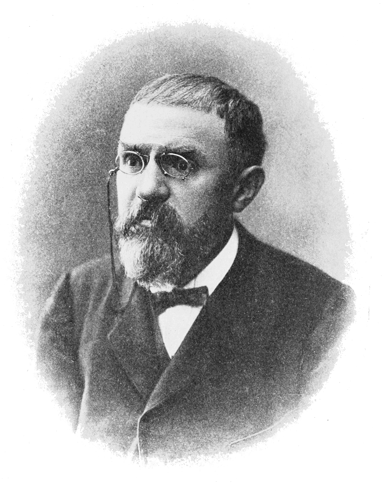

# Poincaré Computing


<div align="center">
  
</div>

> **Backward Trajectory Completion in Bounded Phase Space**

A fundamental reconceptualization of computation: instead of simulating forward from initial conditions, we navigate backward from observed final states to complete trajectories in pre-existing partition structure.

[](https://opensource.org/licenses/MIT)

**[📱 Visit the interactive site](https://fullscreen-triangle.github.io/poincare/)** | **[📄 Read the paper](publication/poincare-trajectory-computing.pdf)** | **[💻 View examples](examples/)**

---

## The Paradigm Shift

### Traditional Computing: Forward Causality

```
Initial conditions → Apply laws → Simulate forward → Final state
```

**Example**: Stone falling from height
- Given: height h = 10m, velocity v₀ = 0, mass m = 1kg
- Apply: F = ma with gravity g = 9.8 m/s²
- Integrate: Equations of motion over time
- Result: Final position on ground

**Requirements**: Initial conditions, governing laws, computational power to simulate every intermediate step.

**Complexity**: O(n² · t/Δt) for n particles simulated over time t with timestep Δt.

### Poincaré Computing: Backward Completion

```
Final state (observed) → Find penultimate state → Recurse → Complete trajectory
```

**Example**: Stone resting on ground
- Given: Stone IS on ground (observation)
- Query: What penultimate state produces this?
- Navigate: Backward through partition hierarchy
- Result: Complete trajectory from initial to final state

**Requirements**: Final observation, partition structure for backward navigation.

**Complexity**: O(log_b M) where M is partition depth, b is branching factor.

---

## Core Insight

**In bounded phase space, all observable states exist as points in categorical partition structure.**

Computation is not simulation—it is **navigation to pre-existing solution coordinates**.

The trajectory already exists. Our task is coordinate resolution, not causal forward-propagation.

---

## Mathematical Foundations

### 1. Bounded Phase Space

For any physical system with finite energy E, phase space is bounded:

```
Ω = {(q, p) : H(q, p) ≤ E}
```

**Poincaré Recurrence Theorem**: Almost all trajectories in bounded phase space return arbitrarily close to initial conditions within finite time.

**Implication**: All observable states lie on closed trajectories.

### 2. Finite Resolution Partitioning

Real observers have finite resolution δ. This partitions continuous phase space into discrete cells:

```
Ω = C₁ ∪ C₂ ∪ ... ∪ Cₙ  (disjoint union)
```

**Number of distinguishable states**: N_max = Ω / h^d (h = Planck's constant, d = dimension)

**Implication**: Physics is fundamentally categorical for bounded observers.

### 3. Triple Equivalence Theorem

**The foundation of Poincaré computing:**

For bounded dynamical systems observed at finite resolution, three mathematical structures are **identical**:

1. **Oscillatory Structure**: Normal modes φᵢ with frequencies ωᵢ
2. **Categorical Structure**: Partition hierarchy with b^M states at depth M
3. **Entropic Structure**: Information coordinates in entropy space

**Knowing any one completely determines the others.**

This equivalence enables:
- Observation = Computation = Processing (single operation, three descriptions)
- Memory address = Semantic content (address IS the data)
- Measurement = Coordinate extraction (no additional processing needed)

---

## S-Entropy Space: The Computational Manifold

### Definition

S-entropy space is the unit cube **[0,1]³** with coordinates:

```
S = (Sₖ, Sₜ, Sₑ)

Sₖ ∈ [0,1]  knowledge entropy (distinguishability)
Sₜ ∈ [0,1]  temporal entropy (evolution stage)
Sₑ ∈ [0,1]  evolution entropy (stability)
```

**Every distinguishable state** of a bounded physical system has a **unique** representation in S-space.

### Ternary Addressing

Three-dimensional S-space admits natural **base-3 addressing**:

```
Address = (t₁, t₂, ..., tₘ)  where tᵢ ∈ {0, 1, 2}

Capacity: 3^M states for depth M
Decomposition: 3^M = 3^Mₖ × 3^Mₜ × 3^Mₑ
```

**Example** (M=9, equal allocation):
```
Address: (1,2,0,1,1,2,0,2,1)
Maps to:
  Sₖ = 1/3 + 2/9 + 0/27 = 0.556
  Sₜ = 1/3 + 1/9 + 2/27 = 0.519
  Sₑ = 0/3 + 2/9 + 1/27 = 0.259
```

### Partition Coordinates

Connection to physics via **quantum numbers**:

```
n = (n, ℓ, m, s)

n ≥ 1         principal quantum number
0 ≤ ℓ < n      angular momentum
-ℓ ≤ m ≤ ℓ     magnetic quantum number
s ∈ {-½, +½}   spin
```

**Partition capacity**: 2n² states (matches atomic shell structure)

**Bidirectional maps**:
- S-coordinates ↔ Ternary addresses
- S-coordinates ↔ Partition coordinates
- Ternary addresses ↔ Partition coordinates

---

## The Core Algorithm: Backward Trajectory Completion

### Problem Statement

**Given**: Final state S_final (observed)
**Find**: Complete trajectory (S₀, S₁, ..., S_final)
**Method**: Recursive penultimate state finding

### Algorithm

```python
def complete_trajectory(S_final):
    trajectory = [S_final]
    current = S_final

    while not is_initial_state(current):
        # Find the state that produces current state
        penultimate = find_penultimate(current)

        if penultimate is None:
            break

        trajectory.append(penultimate)
        current = penultimate

    trajectory.reverse()  # Chronological order
    return trajectory

def find_penultimate(state):
    # Convert state to ternary address
    address = state.to_ternary()

    # Navigate to parent partition (remove last trit)
    parent = address.parent()

    # Get sibling states at same partition level
    siblings = get_siblings(parent)

    # Find which sibling transitions to current state
    for sibling in siblings:
        if transitions(sibling, state):
            return sibling

    return None
```

### Complexity

**Theorem**: Backward trajectory completion requires **O(log_b N)** operations for N total states with branching factor b.

**Proof**:
- Finding each penultimate state: O(b) operations
- Maximum trajectory length: M = log_b(N) levels
- Total: O(M · b) = O(log_b N)

For constant b (typically b=3), this is **O(log N)**.

### Comparison

| Method | Complexity | Example (N=10⁶) |
|--------|-----------|-----------------|
| Forward simulation | O(n² · t/Δt) | ~10²¹ operations |
| Backward completion | O(log_b N) | ~13 operations |
| **Speedup** | **Exponential** | **~10²⁰×** |

---

## Domain Mapping: Universal Application

### The Observer Abstraction

Any domain can use Poincaré computing by implementing an **Observer**:

```rust
trait Observer {
    type Domain;

    // Extract S-coordinates from observation
    fn observe(&self, data: &Self::Domain) -> SPoint;

    // Map to partition coordinates
    fn to_partition(&self, s: &SPoint) -> PartitionCoord;
}
```

### Domain Examples

#### 1. Computer Vision
```rust
struct VisionObserver;

impl Observer for VisionObserver {
    type Domain = Image;

    fn observe(&self, img: &Image) -> SPoint {
        // Apply 12 measurement modalities
        // Sequential exclusion: 10⁶⁰ → 1 unique state
        // Map to S-coordinates
    }
}
```

#### 2. Genomics
```rust
struct GenomicsObserver;

impl Observer for GenomicsObserver {
    type Domain = DNASequence;

    fn observe(&self, seq: &DNASequence) -> SPoint {
        // Cardinal transformation:
        // A→(0,+1), T→(0,-1), G→(+1,0), C→(-1,0)
        // Map to charge states
        // Extract S-coordinates
    }
}
```

#### 3. Mass Spectrometry
```rust
struct MassSpecObserver;

impl Observer for MassSpecObserver {
    type Domain = Spectrum;

    fn observe(&self, spectrum: &Spectrum) -> SPoint {
        // Extract m/z peaks
        // Map to partition coordinates (n, ℓ, m, s)
        // Convert to S-entropy coordinates
    }
}
```

#### 4. Processor State
```rust
struct ProcessorObserver;

impl Observer for ProcessorObserver {
    type Domain = RegisterState;

    fn observe(&self, regs: &RegisterState) -> SPoint {
        // Hardware jitter → virtual gas molecules
        // Thermal fluctuations → S-entropy positions
        // Extract coordinates
    }
}
```

---

## What This Means

### Computation Reconceptualized

**Traditional view**:
```
Computation = Sequential instruction execution
```

**Poincaré view**:
```
Computation = Navigation to pre-existing solution
```

**Implications**:
- Algorithms don't create answers—they **find** them
- Complexity measures navigation difficulty, not processing cost
- P vs NP may be artifact of forward-only thinking
- "Solving" a problem = observing its partition coordinate

### Observation = Computing = Processing

By the Triple Equivalence Theorem:

```
Observe(system) ≡ Compute(state) ≡ Process(information)
```

These are not three operations but **three perspectives on a single act**: categorical state determination.

**Corollary**:
- Measurement without computation is impossible
- Computation without measurement is impossible
- Both are observation acts

### Memory Address ≡ Semantic Content

**Traditional computing**:
- Address: arbitrary location in memory
- Content: meaningful data at that location
- Address ≠ Content (must dereference)

**Poincaré computing**:
- Address: ternary partition coordinate
- Content: complete state specification
- **Address ≡ Content** (address IS the data)

**Implication**: Cache coherency, memory consistency, pointer semantics become trivial.

### Physics Reconceptualized

**Traditional physics**:
- Initial conditions + laws → evolution → final state
- Time: parameter along forward trajectory
- Causality: forward determination

**Poincaré physics**:
- Observation → coordinate → complete trajectory
- Time: dimension in partition hierarchy
- Causality: backward completion

**Observational Determinism**: In bounded phase space, observing the final state determines the entire trajectory—past AND future.

---

## Repository Structure

```
poincaré/
├── publication/               # Rigorous scientific paper
│   ├── poincare-trajectory-computing.tex
│   └── poincare-computing.bib
│
├── docs/                      # Theoretical papers
│   ├── completion/           # Trajectory computing
│   ├── poincare-computing/   # Computational foundation
│   ├── ideal-gas/            # Thermodynamic foundation
│   ├── st-stellas-epistemology/  # Epistemological foundation
│   ├── scattering-puzzle/    # Optical mechanism
│   ├── mass-computing/       # Mass spectrometry application
│   ├── genome/               # Genomics application
│   └── partitioning-limits/  # Fundamental limits
│
├── core/                      # Core Poincaré framework (to be built)
│   ├── rust/                 # Rust implementation
│   │   ├── src/
│   │   │   ├── space.rs      # S-entropy space primitives
│   │   │   ├── address.rs    # Ternary addressing
│   │   │   ├── partition.rs  # Partition coordinates
│   │   │   ├── trajectory.rs # Trajectory structure
│   │   │   ├── navigator.rs  # Backward navigation engine
│   │   │   └── observer.rs   # Domain mapping traits
│   │   └── Cargo.toml
│   │
│   └── python/               # Python bindings
│       ├── poincare/
│       └── pyproject.toml
│
├── adapters/                  # Domain-specific observers
│   ├── vision/               # Computer vision adapter
│   ├── genomics/             # Genomics adapter
│   ├── mass_spec/            # Mass spectrometry adapter
│   └── processor/            # Processor state adapter
│
├── examples/                  # Demonstrations
│   ├── stone_trajectory/     # Classic mechanics example
│   ├── harmonic_oscillator/  # Simple validation
│   └── protein_folding/      # Complex application
│
├── validation/                # Reproduce theoretical results
│   ├── complexity_benchmarks/
│   ├── domain_accuracy/
│   └── consistency_checks/
│
└── tools/                     # Development utilities
```

---

## Quick Start (Coming Soon)

### Installation

```bash
# Rust core
cd core/rust
cargo build --release

# Python bindings
cd core/python
pip install -e .
```

### Basic Usage

```python
from poincare import SPoint, PoincareNavigator

# Create navigator
nav = PoincareNavigator(partition_depth=12, branching_factor=3)

# Observe final state
final_state = SPoint(s_k=0.75, s_t=0.50, s_e=0.25)

# Complete trajectory backward
trajectory = nav.complete_trajectory(final_state)

# Print states
for i, state in enumerate(trajectory):
    print(f"State {i}: {state}")
```

### Domain Adaptation

```python
from poincare import Observer
from poincare.adapters import VisionObserver

# Create domain-specific observer
observer = VisionObserver()

# Process observation
image = load_image("input.png")
s_coords = observer.observe(image)
partition_coords = observer.to_partition(s_coords)

print(f"S-entropy: {s_coords}")
print(f"Partition: (n={partition_coords.n}, l={partition_coords.l})")
```

---

## Theoretical Papers

Comprehensive theoretical development in `docs/`:

1. **Trajectory Computing** (`docs/completion/`): Derives Moon properties from partition structure, establishes observation = computing identity

2. **Poincaré Categorical Computing** (`docs/poincare-computing/`): Computational foundation, processor-oscillator duality, S-entropy space

3. **Ideal Gas Law** (`docs/ideal-gas/`): PV = Nk_B T as categorical balance, thermodynamic foundation

4. **Post-Explanatory Epistemology** (`docs/st-stellas-epistemology/`): WHY the framework must be true from single premise

5. **Refraction Puzzle Imaging** (`docs/scattering-puzzle/`): Opacity-independent measurement, scattering enhancement

6. **Mass Computing** (`docs/mass-computing/`): Complete mass spectrometry implementation, 96.3% accuracy on 4,271 compounds

7. **Nucleic Acid Computing** (`docs/genome/`): Genomic analysis via cardinal transformation, 10¹⁶× speedup

8. **Partition Depth Limits** (`docs/partitioning-limits/`): Five fundamental theorems explaining 41 phenomena with zero free parameters

**Publication-ready paper**: `publication/poincare-trajectory-computing.tex` (50+ pages, comprehensive mathematical treatment)

---

## Related Implementations

Poincaré computing has been applied in specialized domains:

- **[Helicopter](https://github.com/fullscreen-triangle/helicopter)**: Computer vision through categorical completion
- **[Maxwell](https://github.com/fullscreen-triangle/maxwell)**: Categorical processor/memory architecture
- **[Gospel](https://github.com/fullscreen-triangle/gospel)**: Genomic variant detection via partition theory
- **[Lavoisier](https://github.com/fullscreen-triangle/lavoisier)**: Mass spectrometry analysis framework

This repository provides the **core foundation** that unifies these applications.

---

## Fundamental Implications

### For Computer Science

- **Complexity Theory**: New hierarchy based on partition navigation difficulty
- **Algorithm Design**: Focus shifts from procedure to coordinate identification
- **Memory Architecture**: Content-addressed systems become natural
- **Cache Coherency**: Trivial when address = content

### For Physics

- **Measurement Problem**: Observation reveals pre-existing coordinates, no wavefunction collapse
- **Determinism**: Final state determines complete trajectory (past and future)
- **Time**: Dimension in partition hierarchy, not external parameter
- **Causality**: Backward completion, not forward propagation

### For Epistemology

- **Knowledge**: Categorical position in partition space
- **Truth**: Coordinate correspondence, not propositional correspondence
- **Explanation**: Decoupled from solution (post-explanatory knowledge)
- **Gödel's Incompleteness**: Systems know answers without proving them

---

## Contributing

We welcome contributions! This is foundational work requiring:

- **Mathematics**: Rigorous proofs, theorem development
- **Implementation**: Rust core, Python bindings, domain adapters
- **Validation**: Benchmarks, accuracy tests, consistency checks
- **Documentation**: Tutorials, examples, API documentation
- **Applications**: New domain mappings, use cases

See [CONTRIBUTING.md](CONTRIBUTING.md) for guidelines.

---

## Citation

If you use Poincaré computing in your research, please cite:

```bibtex
@article{poincare-computing-2025,
  title={Poincaré Computing: Backward Trajectory Completion in Bounded Phase Space},
  year={2025},
  note={Available at: https://github.com/fullscreen-triangle/poincare}
}
```

---

## License

MIT License - see [LICENSE](LICENSE) for details.

---

## Contact & Discussion

- **Issues**: [GitHub Issues](https://github.com/fullscreen-triangle/poincare/issues)
- **Discussions**: [GitHub Discussions](https://github.com/fullscreen-triangle/poincare/discussions)

---

## Acknowledgments

This framework builds on foundational work by:
- **Henri Poincaré**: Recurrence theorem in bounded phase space
- **Ludwig Boltzmann**: Statistical mechanics and entropy
- **Claude Shannon**: Information theory
- **Rolf Landauer**: Thermodynamics of computation

And countless others who established that bounded systems, finite observations, and categorical structures are fundamental to both physics and computation.

---

**The stone has landed. Its trajectory existed before we calculated.**

**Our task is not simulation but navigation—finding the coordinates where reality's answers reside.**
